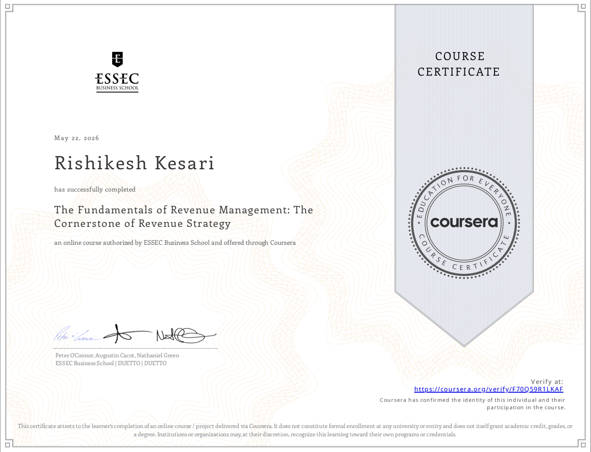

# Revenue Management Foundations  
ESSEC Business School (Coursera)

## Overview

This course introduces the fundamentals of Revenue Management and its application across industries with constrained capacity and variable demand.

Revenue management originated in the airline industry and applies analytical methods to predict consumer behavior at a market level. It is widely used in industries where capacity is fixed or limited and demand is time-sensitive.

The core objective is to optimize pricing, demand allocation, and timing decisions to maximize revenue.

---

## Core Concept

Revenue management is based on:

Right product, right price, right time, right customer.

It focuses on understanding the relationship between:
- Demand and supply
- Customer segmentation
- Price elasticity

The goal is to maximize revenue by allocating the right offering to the right customer at the optimal price and time.

---

## Industry Context

Revenue management is applicable in industries such as aviation, hospitality, transportation, and services with constrained availability.

These environments typically share:
- Fixed or limited capacity
- Time-sensitive or perishable value of availability
- High fixed cost structures
- Fluctuating and uncertain demand

Revenue management supports:
- Reducing revenue leakage
- Improving utilization of capacity
- Enhancing pricing efficiency
- Optimizing profitability under demand uncertainty

---

## Course Structure

The course is organized into four modules:
- Introduction to Revenue Management
- Segmentation
- Forecasting and Budgeting
- Pricing and Revenue Strategy

---

## Key Concepts

### Segmentation
- Understanding different customer groups  
- Identifying willingness to pay differences  
- Tailoring pricing strategies across segments  

---

### Forecasting & Booking Curve
- Using demand forecasting to guide pricing decisions  
- Understanding booking curves and demand patterns over time  
- Linking forecast accuracy to revenue optimization  

---

### Pricing Strategy
- Managing BAR (Best Available Rate)  
- Adjusting prices based on demand and competition  
- Using yielding techniques to maximize revenue  

---

### Distribution Strategy
- Role of OTAs (Online Travel Agencies)  
- Balancing direct bookings vs OTA channels  
- Managing commissions and optimizing channel mix  

---

### Market Intelligence
- Competitor pricing analysis  
- Monitoring market demand signals (OTB – On The Books)  
- Adjusting strategy based on real-time market conditions  

---

## Strategic Insight

Revenue management combines forecasting, pricing, and demand allocation to optimize revenue under capacity constraints and uncertainty.

It relies on structured analytics to predict market behavior and support commercial decision-making.

---

## Key Takeaway

Revenue management is not only about pricing.

It is a structured decision system that aligns demand, pricing, and capacity allocation to maximize revenue performance across time and customer segments.

---

## Future Development

This repository serves as a foundational base for revenue analytics concepts and will be extended into applied projects.

Future work will include:
- Revenue and demand data analysis using real-world datasets  
- Forecasting models for demand and volume prediction  
- Pricing and revenue optimization simulations  
- Interpretation of model outputs for decision-making scenarios  
- Industry case studies across aviation, hospitality, transportation, and services  

The focus will shift from conceptual understanding to practical implementation of revenue analytics workflows.
